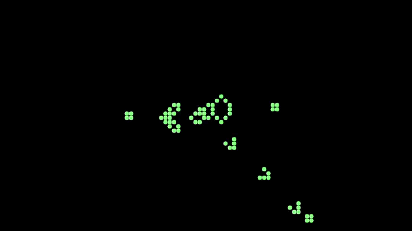

# Topicos de Programación

Este repositorio contiene recursos y ejemplos de programación en C para el curso de Tópicos de Programación de la Universidad Nacional de La Matanza.


## Descripción

Este proyecto contiene una colección de documentos y un proyecto específico titulado "Juego de la Vida". El propósito es proporcionar recursos de aprendizaje y ejemplos prácticos en programación, matemáticas y manipulación de estructuras de datos en C. Incluye bibliotecas estáticas y ejemplos de funciones útiles para el desarrollo de aplicaciones.

Temas abordados por la materia:
* estructuras
* punteros
* manipulaicón de cadenas
* manejo de matrices
* manejo de archivos de texto
* manejo de archivos binarios
* memoria dinámica
* funciones genéricas
* punteros a funciones
* algoritmos de ordenamiento
* algoritmos de búsqueda
* algoritmo de Merge
* creacion de bibliotecas estaticas
* manejo de errores
* creacion de macros
* TDA (Tipos de Datos Abstractos)
* recursividad

## Índice

1. [Documentos](#documentos)
2. [Modelos de Parcial](#modelos-de-parcial)
   1. [sensores-temperatura](#sensores-temperatura)

3. [Proyecto Juego de la Vida](#proyecto-juego-de-la-vida)
   1. [Descripción](#descripción-1)
   2. [Reglas del juego](#reglas-del-juego)
4. [Bibliotecas Estáticas](#bibliotecas-estáticas)
   1. [Descripción](#descripción-2)
   2. [array](#array)
   3. [mathematics](#mathematics)
   4. [matriz](#matriz)
   5. [string](#string)
5. [Instalación](#instalación)
6. [Contribución](#contribución)
7. [Licencia](#licencia)


## Documentos

*  **01-AnciC.pdf** : librerias estandar de C y ejemplos de uso.
*  **IntroduccionC.pdf** : Introduccion a la programacion en C.
*  **Topicos-de-Programacion-(3635)---Ejercicios-propuestos---V2.pdf** : Ejercicios propuestos para la materia.
*  **codigo-ascci.pdf** : Tabla de codigos ASCII.

## Modelos de Parcial
### sensores-temperatura
Solución en C para procesar un archivo de sensores, calculando el promedio de temperaturas solo de sensores en estado 'READY' y desestimando otros estados.

## Proyecto Juego de la Vida

### Descripción

El proyecto "Juego de la Vida" es una implementación del autómata celular propuesto por John Conway en 1970. El juego consiste en una matriz bidimensional de celdas que pueden estar vivas o muertas. En cada iteración, las celdas cambian de estado según un conjunto de reglas simples .El proyecto incluye una implementación en C y una interfaz gráfica utilizando la biblioteca SDL2.

### Reglas del juego

1. Una celda muerta con exactamente 3 celdas vecinas vivas, se convierte en una celda viva.
2. Una celda viva con 2 o 3 celdas vecinas vivas, sigue viva; en otro caso, muere.

<div align = "center">
   
</div>

## Bibliotecas Estáticas

### Descripción

Las bibliotecas estáticas son archivos compilados que contienen funciones y datos que pueden ser utilizados por otros programas. En este proyecto, se incluyen bibliotecas estáticas con funciones útiles para el desarrollo de aplicaciones en C.

### array

*  arrayInsertElementAtPosition : Inserta un elemento en una posición específica de un arreglo.
*  arrayInsertInSortedOrder : Inserta un elemento en un arreglo ordenado.
*  arrayRemoveElementAtPosition : Elimina un elemento de una posición específica de un arreglo.
*  arrayRemoveFirstOccurrence : Elimina la primera ocurrencia de un elemento en un arreglo.
*  arrayRemoveAllOccurrences : Elimina todas las ocurrencias de un elemento en un arreglo.
* shiftLeftOverwrite : Desplaza los elementos de un arreglo hacia la izquierda, sobreescribiendo el primer elemento.
* shiftRightWithInsert : Desplaza los elementos de un arreglo hacia la derecha, insertando un nuevo elemento en la primera posición.
* averageOfPairs : Calcula el promedio de los pares de elementos de un arreglo.
* arrayPrintReverse : Muestra un arreglo en orden inverso.
* sumOfAllElements : Calcula la suma de todos los elementos de un arreglo.
* searchMin : Busca el elemento mínimo en un arreglo.
* searchElement : Busca un elemento en un arreglo.
* binarySearch : Busca un elemento en un arreglo ordenado utilizando búsqueda binaria.
* sortInsertion : Ordena un arreglo utilizando el método de inserción.
* sortSelection : Ordena un arreglo utilizando el método de selección.
* swap : Intercambia dos elementos de un arreglo.


### mathematics

*  power : Calcula la potencia de un número.
*  factorial : Calcula el factorial de un número.
*  binomialCoefficient : Calcula el coeficiente binomial de dos números.
*  ex : Calcula el valor de e^x con una tolerancia dada.
*  absolute : Calcula el valor absoluto de un número.
*  squareRoot : Calcula la raíz cuadrada de un número con una tolerancia dada.
*  isFibonacci : Verifica si un número es un número de Fibonacci.
*  seno : Calcula el seno de un ángulo en radianes con una tolerancia dada.
*  isPerfectNumber : Verifica si un número es un número perfecto.
*  isDeficientNumber : Verifica si un número es un número deficiente.
*  isAbundantNumber : Verifica si un número es un número abundante.
*  multiplyByAddition : Multiplica dos números utilizando sumas sucesivas.
*  divideAndRemainder : Divide dos números y calcula el resto.
*  sumEvenNumbersLessThanN : Calcula la suma de los números pares menores que un número dado.
*  isPrimeNumber : Verifica si un número es un número primo.

### matriz

*  matrixCreate : Crea una matriz dinámica.
*  matrixDestroy : Libera la memoria de una matriz dinámica.
*  matrixShow : Muestra una matriz en la consola.
*  matrixInit : Inicializa una matriz con un valor dado.
*  matrixTrace : Calcula la traza de una matriz cuadrada.
*  sumSecondaryDiagonal : Calcula la suma de los elementos de la diagonal secundaria de una matriz cuadrada.
*  sumAboveMainDiagonal : Calcula la suma de los elementos por encima de la diagonal principal de una matriz cuadrada.
*  sumBelowMainDiagonal : Calcula la suma de los elementos por debajo de la diagonal principal de una matriz cuadrada.
*  sumAboveSecondaryDiagonal : Calcula la suma de los elementos por encima de la diagonal secundaria de una matriz cuadrada.
*  sumBelowSecondaryDiagonal : Calcula la suma de los elementos por debajo de la diagonal secundaria de una matriz cuadrada.
*  isIdentityMatrix : Verifica si una matriz es una matriz identidad.
*  isSymmetricMatrix : Verifica si una matriz es simétrica.
*  sumeMatrix : Suma dos matrices.
*  matrixProduct : Multiplica dos matrices.
*  transposeMatrix : Calcula la transpuesta de una matriz.

### string

* mstrLength : Calcula la longitud de una cadena.
* mstrCat : Concatena dos cadenas.
* mstrnCat : Concatena los primeros n caracteres de una cadena con otra.
* mstrCpy : Copia una cadena en otra.
* mstrnCpy : Copia los primeros n caracteres de una cadena en otra.
* mstrchr : Busca la primera ocurrencia de un carácter en una cadena.
* mstrrchr : Busca la última ocurrencia de un carácter en una cadena.
* mstrCmp : Compara dos cadenas.
* mstrnCmp : Compara los primeros n caracteres de dos cadenas.
* mstrStr : Busca la primera ocurrencia de una subcadena en una cadena.
* mmemmove : Copia una cadena en otra, manejando posibles solapamientos.
* isPalindrome : Verifica si una cadena es un palíndromo.
* stringToInt : Convierte una cadena en un número entero.
* countWordsOccurences : Cuenta las ocurrencias de una palabra en una cadena.
* normalize : Normaliza una cadena.
* searchPosition : Busca la posición de un carácter en una cadena.
* obfuscateStringWithShift : Ofusca una cadena utilizando un desplazamiento de caracteres.


## Instalación

Para instalar y configurar el proyecto, sigue estos pasos:

1. Clona el repositorio:
   ```bash
   git clone https://github.com/MatiasCorpu/topicos-de-programacion.git
   ```

2. Acegurate de tener instalado el compilador de C.
   ```bash	
   gcc --version
   ```


## Contribución

¡Las contribuciones no son aceptadas en este proyecto! Este repositorio es un proyecto personal para el curso de Tópicos de Programación de la Universidad Nacional de La Matanza.


## Licencia

Este proyecto está bajo la Licencia MIT. Consulta el archivo LICENSE para más detalles.


## Contacto

Para cualquier pregunta o sugerencia, puedes contactar a:

*   **Nombre del autor**: Matias Corpu
*   **Correo electrónico**: corpumatiasariel@gmail.com
*   **Perfil de GitHub**: [MatiasCorpu](https://github.com/MatiasCorpu)

